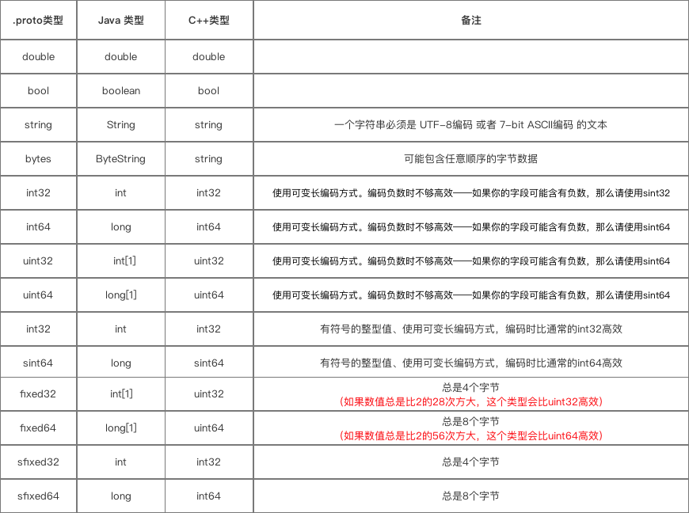

我在研究日志数据存储时候，发现百度曾用的一种数据格式;

### protocol buffer 介绍
google protocol buffer 是一种类似json或xml的一种结构化数据格式；
这种数据格式体积小，传输快，使用简单，加密性好；
它是一种发送方将结构体序列化为二进制字节码，接收方将字节码再反序列化为结构体的方式，解析快速，无需像json或者xml那样，两边添加生成报文和解析报文的编码；
但是缺点就是可读性差，通用性也差；

### protocol buffer 使用
（1）    下载protoc.exe文件

源码在 https://github.com/google/protobuf ， 如果不想自己编译获得最新版本，则可以下载官方编译好的各个平台的，下载地址：https://github.com/google/protobuf/releases。

（2）编写结构体的.proto文件CommEventLog.proto

（3）在window系统下，在protoc.exe所在的文件夹打开cmd，用如下命令生成C++的结构体文件；

protoc –I=./ --cpp_out=./ ./ CommEventLog.proto

protoc执行程序，后面的是命令行参数

-I 输入目录

--cpp_out 输出目录

./ CommEventLog.proto表示需要转换的文件；

最后输出的结果是C++的类文件CommEventLog.pb.cc和CommEventLog.pb.h

（4）将CommEventLog.pb.cc和CommEventLog.pb.h两个文件复制到需要的工程。包含如下头文件，添加libprotobuf.lib、libprotobuf.dll。代码中创建类的对象，CommEventLog evnetlog;

（5）接收到二进制字节码时，用对象的方法ParseFromArray 去将二进制字节码转化为结构体；

if (evnetlog.ParseFromArray(buff,bufflen)==true)

{}

（6）然后就可以用变量名称命名的方法去获取变量的值；

string strtime=evnetlog.start_time();

3         .proto编写格式
3.1  编写示例
Proto文件开头定义一个包名，即命名空间，为了避免不项目的命名冲突问题。然后用关键字message来定制结构体；

package protocobuff_Demo;//包名

message CommEventLog

{

       required string log_id               =     1;//日志Id，唯一标识一次发生的事件

       required int32  event_state      =   2;//事件状态，事件状态为开始或者瞬时时保存事件，状态为结束时更新日志结束时间，状态为更新时保存联动结果；0: 瞬时事件，保存;1: 事件开始，保存;2: 事件结束，更新结束时间;3: 事件脉冲，客户端和服务器使用，CMS不用;4: 事件更新，联动结果更新

       optional int32  event_level            =     3;//事件等级

       optional string unit_idx           =     4;//控制中心编号

       optional int32  event_type            =     5;//事件类型

       optional string event_type_name    =     6;//事件类型名称

       optional int32 sub_sys_type     =   7;//事件所属子系统类型，废弃，事件整改，没有子系统属性了2015-10-28 13:45:13

       optional string event_name             =     8;//事件名称

       optional string start_time         =     9;//事件开始时间

       optional string stop_time       =       10;//事件结束时间

       optional string source_idx        =     11;//事件源编号

       optional int32 source_type              =     12;//事件源类型

       optional string source_name           =     13;//事件源名称

       optional string log_txt                     =     14;//事件描述信息

       optional string region_idx        =     15;//事件源区域编号，可选

       optional bytes  ext_info        =   20;//事件扩展信息,各个子系统根据子系统的消息结构体定义解析

       repeated int32  user_id                 =     21;//事件接收的User Id数组,用于日志查询权限控制

}

3.2  变量修饰符required 、optional、repeated
变量修饰符的作用是修饰变量，确定变量是否必须赋值。

3.3  基本数据类型
基本数据类型用于定义变量类型。与编程语言的中的变量类似，名称稍有不同，含义一致。

